<div align="center">




<br/>


</div>


## `> about_me.java`

```java
public class Juan {

    String role = "Software Developer";

    String[] languages = { "Java", "TypeScript", "JavaScript" };

    String[] backend   = { "Spring Boot", "REST API", "Spring Security", "JWT" };

    String[] frontend  = { "Angular", "HTML", "CSS" };

    String database    = "MySQL";

    String philosophy  = "Build clean. Think big.";
}
```

## Tech Stack

<p>


</p>

---

## GitHub Stats

<p align="center">


</p>

<p align="center">
  
</p>

---

## `> philosophy`

<div align="center">

> **"The future isn't waiting to be discovered. It's built one line of code at a time."**

<br/>


</div>


